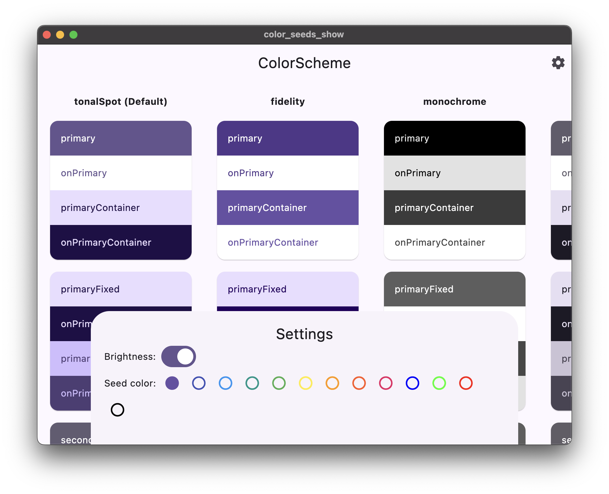

# styling_color_seeds_show

Zeigt wie "color seeds" in Material 3 funktionieren.

Funktioniert am besten als Chrome-App oder macOS-Programm.

## Screenshot

## Herkunft
~~Geklaut~~ Abgeschaut von [ColorScheme.fromSeed constructor]( https://api.flutter.dev/flutter/material/ColorScheme/ColorScheme.fromSeed.html).

